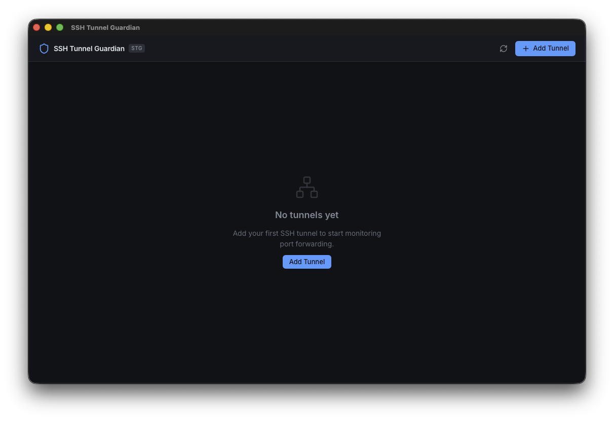
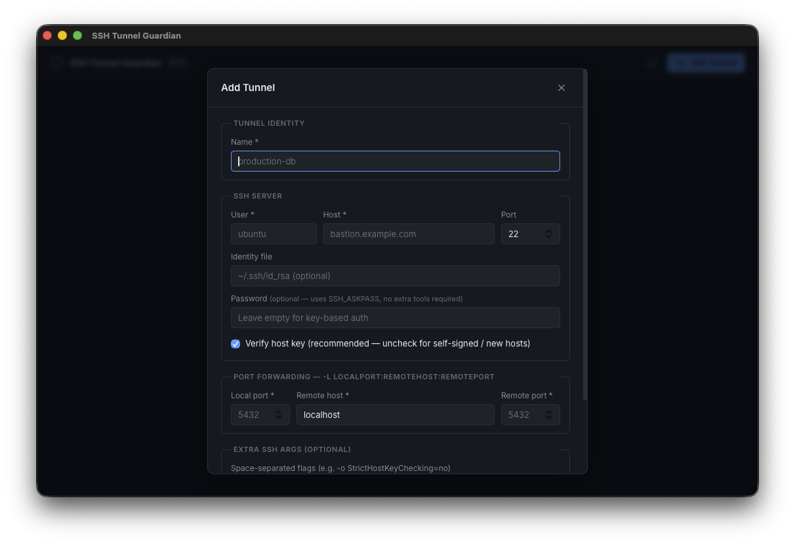

# SSH Tunnel Guardian

A desktop application to manage and monitor `ssh -L` tunnels with automatic reconnection, TCP health checks, and real-time status tracking.

Built with [Tauri v2](https://tauri.app/) (Rust backend) and [React 18](https://react.dev/) (TypeScript frontend).

---

## Features

- **Tunnel management** — add, edit, remove, start, stop, and restart SSH port-forward tunnels from a clean UI
- **Real-time health checks** — periodic TCP probes on the local port detect broken tunnels before your app does
- **Auto-reconnect with exponential backoff** — configurable max attempts, initial delay, multiplier, and jitter (±10%)
- **State machine** — each tunnel progresses through well-defined states: `STARTING → HEALTHY → DEGRADED → RECONNECTING → FAILED / STOPPED`
- **Error classification** — SSH stderr is parsed to distinguish auth failures, broken pipes, port conflicts, unreachable hosts, and more
- **Password auth via SSH_ASKPASS** — no third-party tools required; uses OpenSSH's native askpass mechanism
- **StrictHostKeyChecking toggle** — disable host-key verification per tunnel for new or self-signed hosts
- **Live log panel** — per-tunnel log stream with level badges (DEBUG / INFO / WARN / ERROR)
- **Dark UI** — GitHub-inspired dark design system

---

## Screenshots





---

## Requirements

| Tool | Version |
|------|---------|
| [Rust](https://rustup.rs/) | 1.77+ |
| [Node.js](https://nodejs.org/) | 18+ |
| [pnpm](https://pnpm.io/) | 8+ |
| macOS | 12 Monterey+ (primary target) |
| OpenSSH | 8.4+ (pre-installed on macOS) |

> Linux and Windows are supported by Tauri, but only macOS has been tested.

---

## Getting started

```bash
# 1. Clone
git clone https://github.com/<your-username>/ssh-tunnel-guardian-tauri.git
cd ssh-tunnel-guardian-tauri

# 2. Install frontend dependencies
pnpm install

# 3. Run in development mode (hot-reload)
pnpm tauri dev
```

### Production build

```bash
pnpm tauri build
```

The signed `.app` bundle and `.dmg` installer are placed in `src-tauri/target/release/bundle/`.

### Replacing the app icon

Provide a square PNG ≥ 1024×1024 and run:

```bash
pnpm tauri icon /path/to/your-icon.png
```

This regenerates all platform icon sizes inside `src-tauri/icons/` automatically.

---

## Project structure

```
ssh-tunnel-guardian-tauri/
├── src/                        # React 18 + TypeScript frontend
│   ├── components/             # UI components
│   │   ├── Header.tsx
│   │   ├── TunnelCard.tsx
│   │   ├── AddTunnelModal.tsx
│   │   ├── StatusBadge.tsx
│   │   ├── LogsPanel.tsx
│   │   ├── EmptyState.tsx
│   │   └── ErrorBoundary.tsx
│   ├── hooks/
│   │   └── useTauriEvents.ts   # Tauri event subscriptions
│   ├── lib/
│   │   └── tauriApi.ts         # Type-safe invoke/listen wrappers
│   ├── store/
│   │   └── tunnelStore.ts      # Zustand + Immer state store
│   ├── types/
│   │   └── index.ts            # TypeScript mirror of Rust types
│   └── App.tsx
│
└── src-tauri/                  # Rust backend
    └── src/
        ├── tunnel/
        │   ├── types.rs        # Shared types (serde, Tauri IPC)
        │   ├── state_machine.rs # FSM transitions + backoff
        │   ├── error_classifier.rs # SSH stderr → ErrorKind
        │   ├── health.rs       # TCP health check loop
        │   ├── process.rs      # SSH process spawn (SSH_ASKPASS)
        │   └── manager.rs      # Async supervisor loop
        └── commands/
            └── tunnel_commands.rs # 9 Tauri commands
```

---

## Architecture

```
┌─────────────────────────────────────────────────────┐
│  React UI (WebView)                                  │
│  Zustand store ←── useTauriEvents (listen)           │
│       │                                              │
│       └──── tauriApi (invoke) ──────────────────┐   │
└────────────────────────────────────────────────┼──┘
                                                 ▼
┌─────────────────────────────────────────────────────┐
│  Tauri Commands (Rust)                               │
│  add_tunnel / start_tunnel / stop_tunnel / …         │
│       │                                              │
│       ▼                                              │
│  TunnelManager  (tokio tasks per tunnel)             │
│  ┌─────────────────────────────────────────┐        │
│  │  Supervisor loop                         │        │
│  │  ├── spawn_ssh (SSH_ASKPASS if needed)   │        │
│  │  ├── health check loop (TCP probe)       │        │
│  │  ├── state_machine transitions           │        │
│  │  └── error_classifier (stderr parsing)  │        │
│  └─────────────────────────────────────────┘        │
│       │                                              │
│       └──── app.emit()  ──► stg://tunnel-state-changed
│                         ──► stg://tunnel-metrics     │
│                         ──► stg://tunnel-log         │
└─────────────────────────────────────────────────────┘
```

### Tunnel states

```
              start()
  STOPPED ──────────────► STARTING
                               │
              TCP ok           │ process exits
  DEGRADED ◄──────────── HEALTHY  ──────────────► RECONNECTING
     │           TCP fail   ▲                          │
     │                      │  TCP ok / process ok     │ max attempts
     └──────────────────────┴──────────────────────────► FAILED
```

---

## Tauri commands

| Command | Description |
|---------|-------------|
| `get_tunnels` | List all tunnels with current state |
| `get_tunnel` | Get a single tunnel by ID |
| `get_tunnel_logs` | Fetch recent log entries for a tunnel |
| `add_tunnel` | Create and persist a new tunnel config |
| `update_tunnel` | Update config of an existing (stopped) tunnel |
| `remove_tunnel` | Delete a tunnel |
| `start_tunnel` | Start the SSH process and supervision loop |
| `stop_tunnel` | Gracefully stop the tunnel |
| `restart_tunnel` | Stop then immediately start |

---

## Configuration

Each tunnel exposes these options:

| Field | Default | Description |
|-------|---------|-------------|
| `sshHost` | — | SSH server hostname or IP |
| `sshPort` | `22` | SSH server port |
| `sshUser` | — | SSH username |
| `localPort` | — | Local port to bind (`127.0.0.1:<localPort>`) |
| `remoteHost` | — | Remote host reachable from the SSH server |
| `remotePort` | — | Remote port to forward to |
| `identityFile` | `null` | Path to private key (optional) |
| `sshPassword` | `null` | Password for authentication (uses SSH_ASKPASS) |
| `strictHostChecking` | `true` | Verify the server's host key |
| `reconnect.maxAttempts` | `10` | Max reconnection attempts before FAILED |
| `reconnect.initialDelayMs` | `1000` | First backoff delay |
| `reconnect.maxDelayMs` | `60000` | Backoff ceiling |
| `reconnect.multiplier` | `2.0` | Exponential multiplier (±10% jitter) |
| `healthCheck.intervalMs` | `5000` | How often to TCP-probe the local port |
| `healthCheck.timeoutMs` | `3000` | Probe timeout |
| `healthCheck.failureThreshold` | `3` | Consecutive failures → DEGRADED |
| `healthCheck.recoveryThreshold` | `2` | Consecutive successes → HEALTHY |

---

## Running tests

```bash
# Rust unit tests (state machine, error classifier, process args)
cd src-tauri && cargo test

# TypeScript type check
pnpm check
```

---

## Tech stack

| Layer | Technology |
|-------|-----------|
| Desktop shell | [Tauri v2](https://tauri.app/) |
| Backend language | Rust + [tokio](https://tokio.rs/) |
| Frontend framework | React 18 |
| Language | TypeScript (strict) |
| State management | [Zustand v5](https://zustand-demo.pmnd.rs/) + [Immer](https://immerjs.github.io/immer/) |
| Build tool | [Vite](https://vitejs.dev/) |
| Package manager | pnpm |
| Icons | [lucide-react](https://lucide.dev/) |

---

## License

MIT — see [LICENSE](LICENSE).
